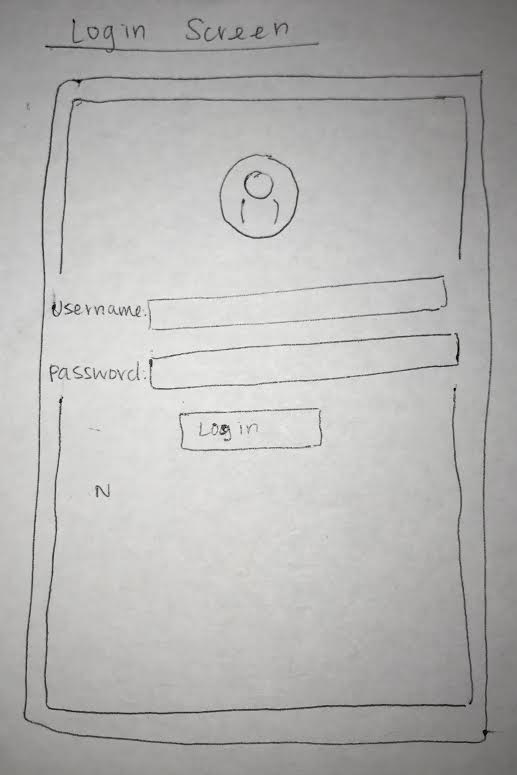
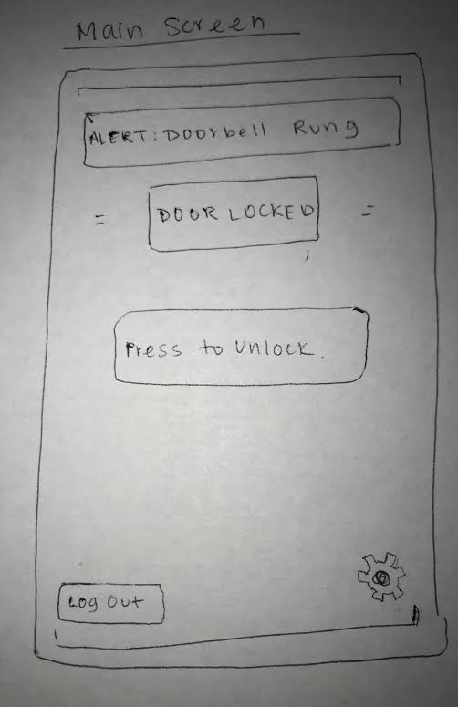
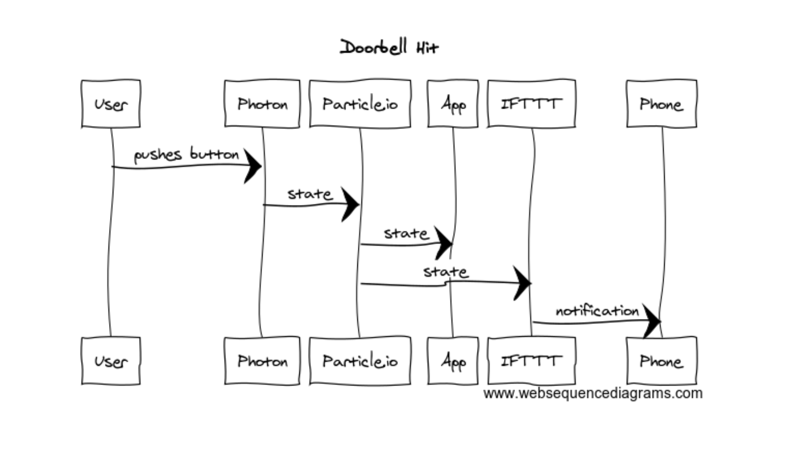
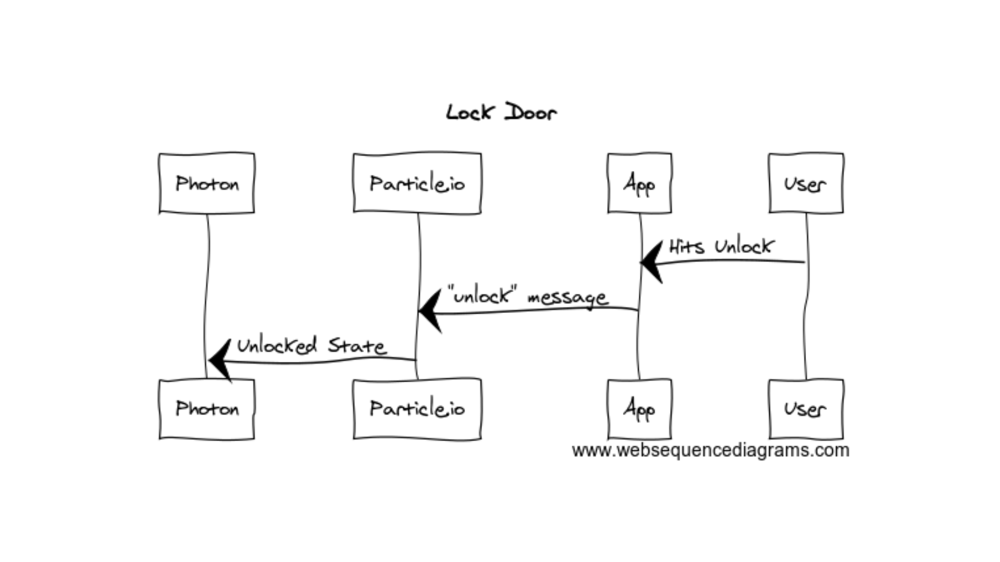
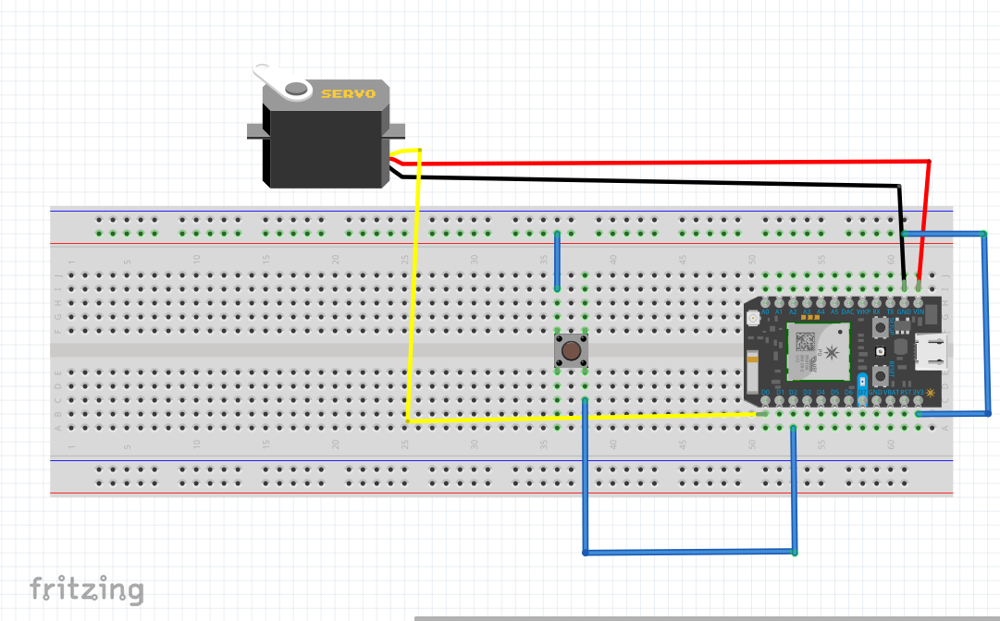

## 2. Developer Documentation

### Hardware Needed:
* Button
* Hobby Servo
* 3 Wires
* Particle photon
* Breadboard

### Cloud Infrastructure:
* Particle.io
* IFTTT

### UI

#### Paper Prototypes

This screen features text boxes to allow the users to log in to their respective account.

This screen features an alert box to tell if the doorbell has been run, a door status box to tell
if the door is locked, as well as a button that will change to lock or unlock the door depending on the state of the door. There is also a log out button and a settings button to navigate to the other pages.

This screen features and "Enable Auto-close" button in addition to a slider that can determine how long before the door automatically closes. It also features a back button to navigate back to the main screen.

#### Sequence Diagrams

This describes when a user comes up to the physical doorbell and hits the door bell.  The photon then sends that hit state
through particle.io which sends the state to update both the UI and send to IFTTT which will send a message to one's phone

This describes when a user hits "unlock" on the UI main page. The java script file sends this "unlock" state to particle.io which then
sends it through particle.io to the particle which will preform the proper task based on that state such as changing the servo motor.

#### Sequence Diagrams

### Files

* doorbellApp.js
This is the javascript file that interacts with our UI.  Based on the doorbell.js which acts as a doorbell model of the hardware, this files updates our HTML file to show the correct state of the doorbel and the lock. Any changes to code that should affect the javascript on purely the UI side should go here.

* doorbell.js
This file is our doorbell object javascript file. It manages interaction between the particle and the UI, updating the state. Any changes to the functionality of UI to particle interaction should go here. For example, if you would like to add functionality to the UI, add the button/interaction/event, then publish to the particle event stream here.

* index.html
This is the html file of our UI, single page web app. If there is anything to add regarding the structure of the UI, making it a mobile app, or on click functionality, add it here

* particle.min.js
Imported particle's javascript library. You shouldnt need to change this.

* style.css
This is our stylesheet. Add any styles that you would like.

* doorbell.ino
Our ino to control the hardware of our prototype. Anything that handels managing the hardware should go in the ino file. Add particle functions here to update state. 
