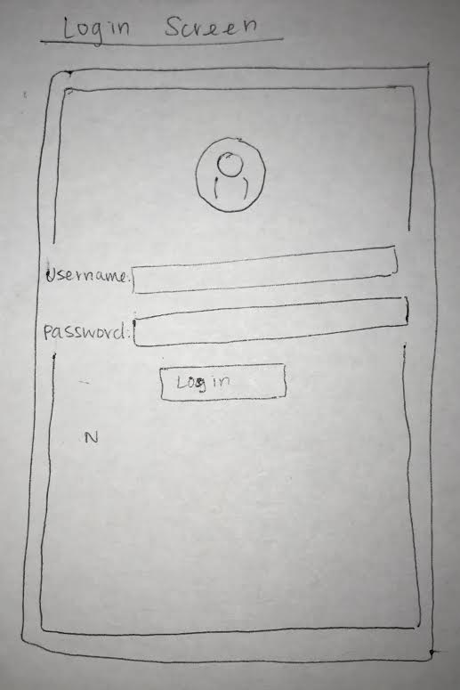
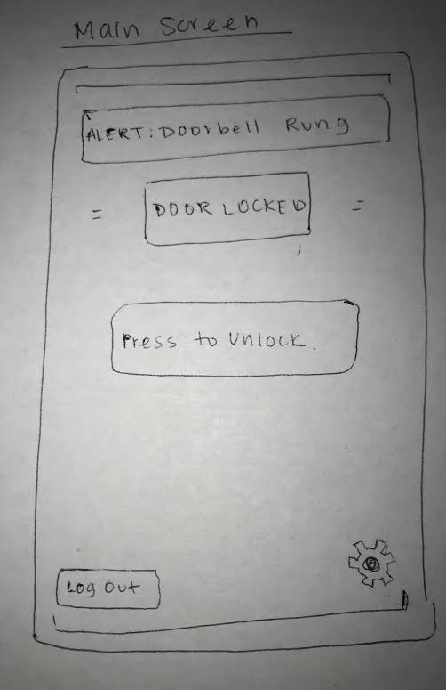
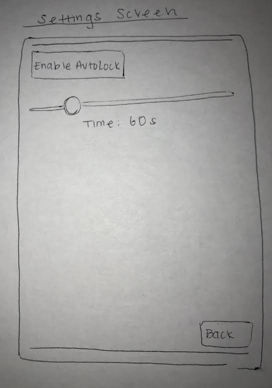
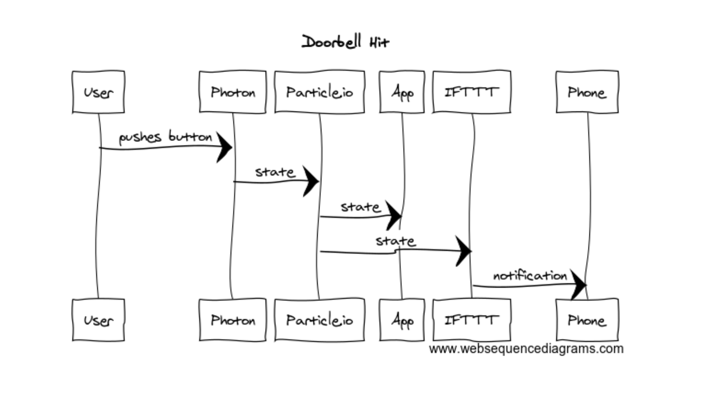
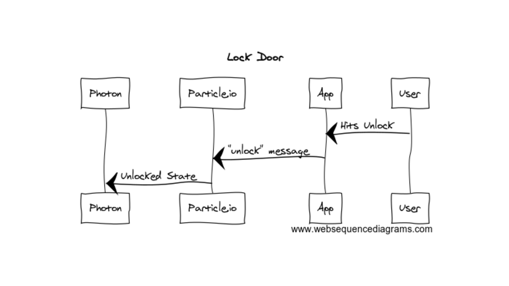

# 1. Description

Our target market for our project are US consumers who own homes and have disposable income.  Our product is not country specific so likely will allow expansion to much of the developed world who have a home they would like to keep secure and do not want to take the effort to walk over to the door to unlock it if they are expecting a guest.  In addition to consumers who may not want to walk down to unlock their door this also promises users with a IOT lock that will allow them to monitor the status of their door and lock it if they realize they have forgotten.  
Since our app and device allow the user to control who enters their home without them needing to be home, our doorbell application solves issues relating to both security and convenience. Without our application, if there was a point during the day where an individual  needed to let someone into their home, for example the mailman, a house sitter, or a dog walker, they would have to have the package left outside, give the other person a key, or leave the door unlocked for the day. All of these options prove particularly insecure, given they would either involve leaving a potential valuable outside or allowing access to someone the user might not know very well. However, with our app, this would no longer be an issue. Our application solves this problem by having the lock on the door controlled by an app, where the homeowner can either lock or unlock the door from wherever they are at the time. Whoever needs access to the house would simply ring the doorbell and, upon ring, the owner would be notified and given the option of unlocking or locking the door. Further, the owner would also be able to re-lock the door after it has been unlocked. The owner would also be able to constantly check the status of their lock, to ensure that it is locked or unlocked when it needs to be.
This doorbell lock combination connected through IOT is well merited. First, on the doorbell side often when a guest/service person rings the door our target consumer may be somewhere within their home/apartment which is inaudible to the central doorbell but if when their doorbell is hit their alexa rings or their phone sends them a text, they will more easily be able to hear and respond to the request at the door than if it was only a single sound from a central home area.  On the lock side, when the consumer’s doorbell gets rung if they are away from the home or far away it is a hassle to walk downstairs and manually switch the lock but if the consumer can switch and check the status of the lock via the internet it will save them time and safety.
This product would definitely be worth the cost, as the actual device is relatively inexpensive for the immense gains in security and convenience that comes with use of the device. In terms of costs going into hardware implementation, all the device would need is a Photon, a button, LED’s, and the lock. Given the simplicity in design, the lock would likely require very little maintenance and little update to design. In terms of installation, the doorbell would just have to be attached to the door and power, and a corresponding lock will be installed in place of the current door handle. Outside of that, cost would mainly come from development.The low cost of the device in comparison with the utility gained from active use of the application, making the project extremely cost effective.  

# 2. Hardware and Cloud Infrastructure Needed

## Hardware:
* Button
* Hobby Servo
* Wires
* Resistors
* Particle photon
* Breadboard
* Red and Green LEDs

## Cloud Infrastructure:
* Particle.io
* IFTTT
* Considering integration with AWS IOT

# 3. Unknowns and Challenges
There will be a number of challenge to overcome to insure that our UI implementation works effectively with the device, particularly because there are some aspects of the project that we have not explored enough yet. Specifically, we will have to explore IFTTT and it’s capabilities in more depth to ensure full functionality when incorporated in our project. In terms of our simulation, it will be helpful to become more familiar with the hobby servo motor and how it can be used to simulate a lock.

# 4. User Stories & Usage Scenarios

## User Story One
Assumption: User is logged into app and is not viewing status screen
Story: The doorbell has been rung so the user wants to unlock the door so they:
* Are notified on their phone, which they click and takes them to the app
* Presses the “Unlock” button

# User Story Two
Assume: Individual is at the door and wants to be let in
Story: The User wants to be let in so they:
* Press the doorbell button
* Wait for green LED
* Open the door

# 5. Paper Prototypes

This screen features text boxes to allow the users to log in to their respective account.

This screen features an alert box to tell if the doorbell has been run, a door status box to tell
if the door is locked, as well as a button that will change to lock or unlock the door depending on the state of the door. There is also a log out button and a settings button to navigate to the other pages.

This screen features and "Enable Auto-close" button in addition to a slider that can determine how long before the door automatically closes. It also features a back button to navigate back to the main screen.

# 6. Implementation: Sequence Diagrams

This describes when a user comes up to the physical doorbell and hits the door bell.  The photon then sends that hit state
through particle.io which sends the state to update both the UI and send to IFTTT which will send a message to one's phone

This describes when a user hits "unlock" on the UI main page. The java script file sends this "unlock" state to particle.io which then
sends it through particle.io to the particle which will preform the proper task based on that state such as changing the servo motor.

# 7. Plan and Schedule

## Weekly Schedule / Progress

| Week End     | Deliverables & Accomplishments |
|:-------------|:-------------------------------|
| By April 7   |  Have UI Base Completed/Hardware configured                              |
| By April 14  |  Have doorbell -> app interaction working                             |
| By April 21  |  Have app -> doorbell interaction working                              |
| April 24th   |  Complete Project Due!         |

## Group Member Responsibilities (Groups only)

| Name         | Responsibilities |
|:-------------|:-----------------|
|       Soraya Moss       |       UI,Hardware,IFTTT          |
|       Sam Margolis      |       .ino file, keeping group on time, user account        |

## Times Reserved for Project Work

Fill in a schedule of times reserved for the project.  If you can't set regular weekly times, create a schedule based on specific days.

| Week Day | Times | Who (if on a team) |
|:---------|:------|--------------------|
| Monday   |   4-6    |      Soraya and Sam              |
| Tuesday  |       |                    |
| Wednesday|   4-7   |         Soraya and Sam           |
| Thursday |       |                    |
| Friday   |       |                    |
| Saturday |       |                    |
| Sunday   | 10-1   |      Soraya and Sam              |
